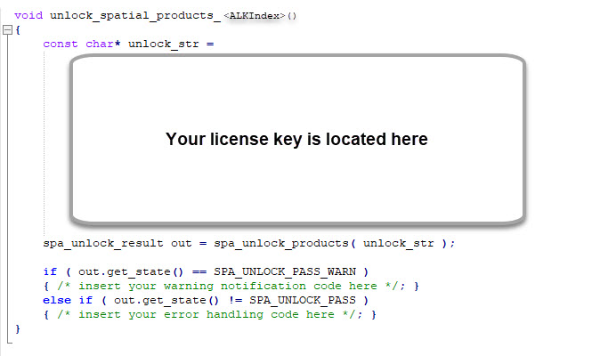

# RWSAT - ACIS Extensions for NURBS-Python (geomdl)

This repository contains the `rwsat` project and it contains 2 modules

* `sat2json` for extracting spline geometries and trim curves from ACIS .SAT files
* `satgen` for generating sample geometries to test `sat2json`

The `rwsat` project is based on the work of [Dr. Adarsh Krishnamurthy](https://www.me.iastate.edu/faculty/profile/adarsh)
with various improvements and new features.

## Requirements

1. [CMake](https://cmake.org)
2. [3D ACIS Modeler](https://www.spatial.com/)

## Compiling RWSAT

1. Clone the repository: `git clone https://github.com/orbingol/rwsat.git`
2. Enter the directory: `cd rwsat`
3. Update submodules: `git submodule update --init`
4. Use CMake to generate make files
5. Use `make install` to compile and install into the build directory

## Using RWSAT

### sat2json

The simplest way to use `sat2json` is as follows:

```
$ sat2json MODEL.sat licence_file=license.dat
```

This command will convert `MODEL.sat` into a JSON file which is directly readable by
[geomdl](https://github.com/orbingol/NURBS-Python) via `exchange.import_json` API call.

The `license.dat` contains your **unlock_key** which can be found inside your license
source file at the following location:



Run `sat2json` without any command-line arguments for more details on using the application.

### satgen

The simplest way to use `satgen` is as follows:

```
$ satgen SAMPLE.sat licence_file=license.dat
```

The arguments are very similar to `sat2json` command. Please note that the `SAMPLE.sat` file
is the output of the `satgen` command.

## Author

* Onur Rauf Bingol ([@orbingol](https://github.com/orbingol))

## License

* RWSAT is licensed under the terms of the [BSD 3-Clause License](LICENSE)
* [JsonCpp](https://github.com/open-source-parsers/jsoncpp) is licensed under the terms of the [MIT License](https://github.com/open-source-parsers/jsoncpp/blob/master/LICENSE)
* ACIS and SAT are registered trademarks of [Spatial Corporation](https://www.spatial.com/)
